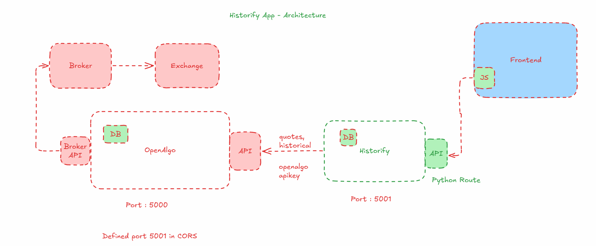

# Historify - Stock Historical Data Management App

Historify is a comprehensive web-based application designed to download, store, and visualize historical and real-time stock market data. The application provides an intuitive interface for managing stock data with features like dynamic watchlists, advanced interactive charts, and incremental data updates.



## Features

- **Data Management**: Download historical stock data directly into SQLite database without intermediate CSV files
- **Multiple Exchanges**: Support for various exchanges including NSE, BSE, NFO, MCX and more
- **Dynamic Watchlist**: Create and manage watchlists with real-time quotes
- **Advanced TradingView Charts**: Visualize stock data using TradingView lightweight charts with synchronized indicators
- **Technical Indicators**: Add popular indicators like EMA and RSI with customizable parameters
- **Crosshair Synchronization**: Synchronized crosshair between price chart and indicator panels
- **Multiple Timeframes**: Support for various timeframes (1m, 5m, 15m, 30m, 1h, 1d, 1w)
- **Batch Processing**: Process symbols in configurable batches with checkpointing
- **Modern UI**: Clean and responsive interface built with Tailwind CSS and DaisyUI
- **Light/Dark Mode**: Toggle between light and dark themes
- **Real-time Data Updates**: Auto-refresh functionality for watchlist and charts

## Installation

1. Clone the repository:
   ```
   git clone https://github.com/marketcalls/historify.git
   cd historify
   ```

2. Create a virtual environment and activate it:
   ```
   python -m venv venv
   source venv/bin/activate  # On Windows use: venv\Scripts\activate
   ```

3. Install dependencies:
   ```
   pip install -r requirements.txt
   ```

4. Create a `.env` file based on `.env.sample` and customize your settings:
   ```
   cp .env.sample .env
   # Edit .env file with your preferred settings
   ```

5. Run the application:
   ```
   python run.py
   ```

6. Access the application at `http://localhost:5001`

## Project Structure

```
historify/
├── app/
│   ├── models/          # Database models
│   ├── routes/          # Route blueprints
│   ├── static/          # Static assets (JS, CSS)
│   ├── templates/       # Jinja2 templates
│   ├── utils/           # Utility functions
│   └── __init__.py      # App initialization
├── instance/            # Instance-specific data (DB file)
├── .env                 # Environment variables
├── .gitignore           # Git ignore file
├── LICENSE              # MIT license
├── README.md            # This file
├── requirements.txt     # Dependencies
└── run.py               # Application entry point
```

## API Endpoints

- **`/api/symbols`**: Get list of available symbols
- **`/api/download`**: Trigger data download and storage
- **`/api/watchlist`**: Manage watchlist symbols
- **`/charts/api/chart-data/<symbol>/<exchange>/<interval>/<ema_period>/<rsi_period>`**: Fetch OHLCV data with indicators for TradingView charts
- **`/api/quotes`**: Fetch real-time quotes for watchlist symbols

## Using TradingView Charts

1. **Accessing Charts**:
   - Click on the chart icon next to any symbol in your watchlist
   - Or navigate directly to `/charts?symbol=<SYMBOL>&exchange=<EXCHANGE>`

2. **Customizing Indicators**:
   - Adjust EMA period using the EMA Period selector
   - Adjust RSI period using the RSI Period selector
   - Click "Apply" to update the chart with new parameters

3. **Timeframe Selection**:
   - Use the timeframe dropdown to select different intervals (1m, 5m, 15m, 30m, 1h, 1d, 1w)

4. **Chart Navigation**:
   - Scroll to zoom in/out
   - Click and drag to pan the chart
   - Hover to see detailed price information at any point
   - Crosshair synchronization allows you to track price and indicators simultaneously

5. **Theme Integration**:
   - Charts automatically adapt to your selected theme (light/dark mode)

## Technology Stack

- **Backend**: Flask, SQLAlchemy, SQLite
- **Frontend**: Tailwind CSS, DaisyUI, TradingView Lightweight Charts 3.8.0
- **Data Handling**: Python data processing utilities, Pandas for technical indicators
- **API Integration**: OpenAlgo API for historical data and quotes

## TradingView Charts Implementation

The application features a sophisticated charting system built with TradingView's Lightweight Charts library:

- **Candlestick Charts**: Visualize price action with customizable candlestick charts
- **Technical Indicators**: 
  - EMA (Exponential Moving Average) with adjustable periods
  - RSI (Relative Strength Index) with adjustable periods
- **Chart Synchronization**: Synchronized crosshair between the main price chart and indicator panels
- **Time-based Navigation**: Easily navigate through different time periods
- **Responsive Design**: Charts adapt to different screen sizes
- **Theme Integration**: Charts automatically adapt to light/dark mode
- **Real-time Updates**: Charts can be configured to update automatically
- **Error Handling**: Robust error handling for data fetching and processing

## License

This project is licensed under the MIT License - see the [LICENSE](LICENSE) file for details.

## Integration with OpenAlgo

To integrate Historify with OpenAlgo, add the following CORS settings to your OpenAlgo `.env` file:

```
CORS_ALLOWED_ORIGINS = 'http://127.0.0.1:5000,http://127.0.0.1:5001'
```

This allows cross-origin requests between Historify (running on port 5001) and OpenAlgo.

## Contributions

Contributions are welcome! Please feel free to submit a Pull Request.
